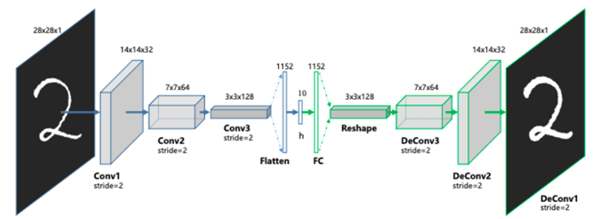
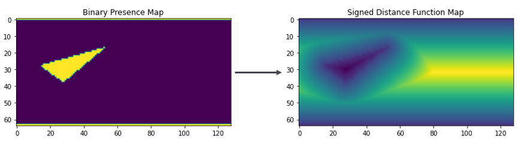
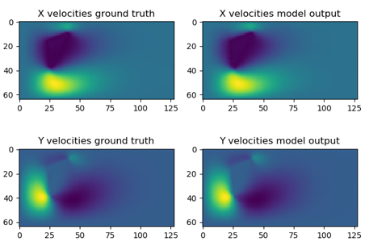

# 2D Steady Fluid Flow Via Convolutional Neural Network

Group Project for UCSD ECE 228 - Predicting 2D Steady state fluid flow fields with Convolutional Neural Networks.

---

Three different styles of architectures were examined:

- Feed Forward Encoder-Decoder:

<kbd>
  
</kbd>

- ResNet:

<kbd>
  
</kbd>

- U-Net:

<kbd>
  
</kbd>

---

The network models were trained on data generated using the PyLBM library and consisted of open fluid domains with elementary objects included in the fluid domain. 

The flow field was encoded using signed-distance functions:

<kbd>
  
</kbd>

The Networks were able to adeqauately predict the flow fields given an elementary object in the flow fields. Future work will involve multiple objects and more complex geometries as the functionality becomes available in the 2D fluid solvers. 

<kbd>
  
</kbd>

To run the Encoder-Decoder model, download the steady state data from https://drive.google.com/file/d/1KBQAjNUeEm7JcbpA7uK18aAsL7nDr75P/view?usp=sharing. 
Put the data in the same directory as the symmetrical_ae.py and run the script.

To run the U-NET model, uncompress UNET.7z, move the data into that folder, and run the train.py script inside.
To run the Resnet-18 model, repeat the same process as used for the U-Net model. 
